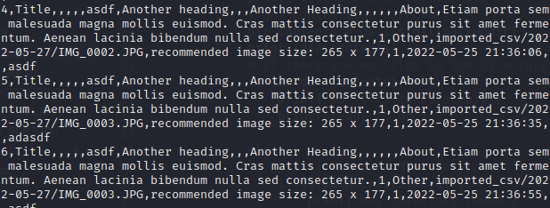
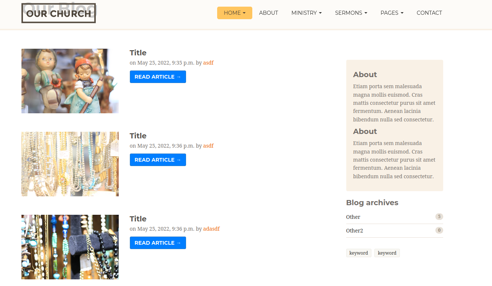

# Automating Django Model Imports from Chromebook

#### Contents 
- [Network Topology](#Network-Topology)
- [Code Coverage](#Code-Coverage)
#### Code Coverage
Code Coverage is an absolute necessity in programs to catch and raise errors before executing commands that could damage the system. In this example, Code Coverage will be very important during a backup and migration of our data, so it is important that all directories are created and handled without toppling the subsequent functions of the program. 
- [Requirements](#Requirements)
#### Requirements
- Google Drive & A Chromebook 
- Python3
- Django
- Django-Import-Export
- [Script Breakdown](#Script-Breakdown)

# Script Breakdown
| Function|  Estimated Coverate   |
| --- | --- |
| Media|  100%    |
| --- | --- |
| Export Models|  10%    |
| --- | --- |
| Migrate & Write CSV|  50%    |
| --- | --- |
| Rotate|  5%    |
| --- | --- |

- The Media Function is 100% a test function that is testing the Host OS and compatibility for mounting Google Drive to a Linux container. Chromebooks have this feature available to rotate files and compress into .tar.gz files to store the previous demonstration for a client.

```
# check os directory exists or Exit
if not os.path.exists('/mnt/chromeos/GoogleDrive'):
print('Google Drive not mounted')
exit()
```

- The remaining scripts since they are testing within the Django Framework, must be executed with `python3 manage.py shell < script.py`. 
	-  This script includes a test where the directory exists and if it does, that is where django will export the resources to. This is where the base format of the csv is created. 

- After the CSV templates are generated, a Function Migrate will have 50% code coverage. The function will: 
	- Validate backupcsv folder to dump all old csv files to in tar.gz format. 
	- Validate generatedcsv folder
	- Create a directory in %y%m%d format for media folder to avoid Django throwing an exception. 
	- Link files in the media folder randomly for the latest directory entry and generate new CSV files for import. 
		```
		project_name = ''.join(random.choice(string.ascii_uppercase + string.digits) for _ in range(10))
        ```
	- Only writes to models with Images in the Header
	

- Lastly, the Rotate function will provide make sure files in generatedcsv get tar.gz to backupcsv and will then proceed to upload all csv files into Django Models. 
```# add event_data.csv to dataset
with open('generatedcsv/event_data.csv', 'r') as f:
# create tablib dataset from csv file
dataset = tablib.Dataset().load(f.read())

# import the dataset to the database
EventResource().import_data(dataset, dry_run=False)
f.close()
```


